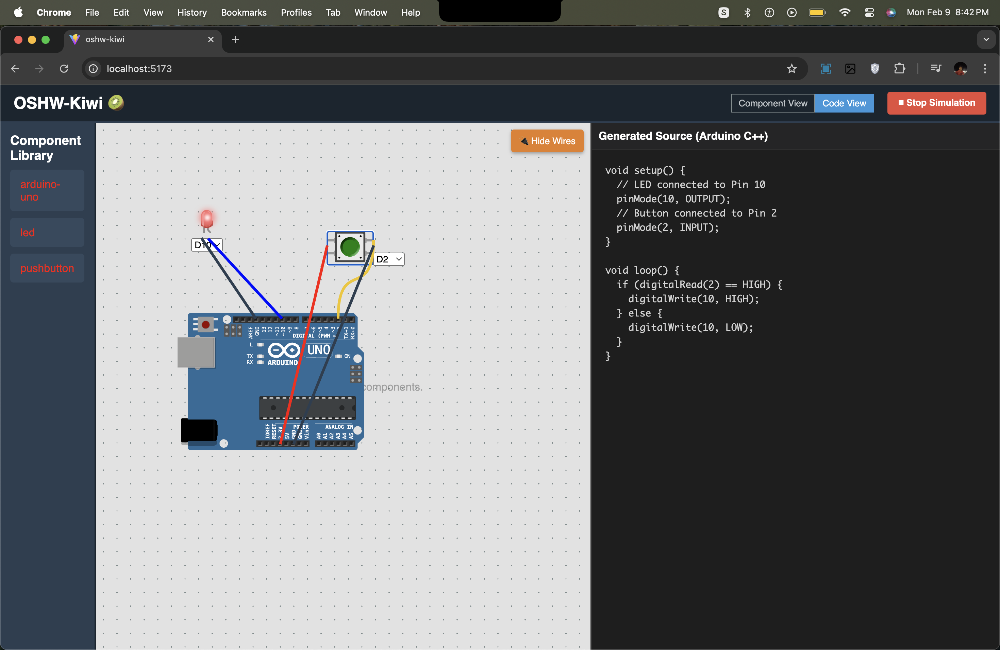

<div align="center">

  <h1>
    OSHW-Kiwi 🥝
  </h1>
  
  <p>
    An interactive, web-based Arduino simulator for learning electronics, built with React and Wokwi Elements (for FOSSEE OSHW @ IIT-B).
  </p>

</div>

<div align="center">
  <a href="https://github.com/virajsh4h/oshw-kiwi/stargazers">
    
  </a>
  <a href="https://github.com/virajsh4h/oshw-kiwi/blob/main/LICENSE">
    
  </a>
  
  
  
</div>

---

### 🎥 Live Demo & Video Walkthrough

This project was built to be interactive! The best way to understand it is to see it in action, or better yet: use it yourself **( [Click here to access web version](https://oshw-kiwi.vercel.app/) )**.

<a href="https://www.youtube.com/watch?v=YOUTUBE_VIDEO_ID_HERE" target="_blank">
  
</a>

> **Note:** The screenshot above is a placeholder. Click it to watch the full video walkthrough..

---

### ✨ Core Features

OSHW-Kiwi provides a complete, logic-level simulation environment that fulfills all 3 screening task requirements as specified by FOSSEE OSHW (2026), and more!

- **✅ Drag & Drop Interface:** Easily add components from the library to the canvas.
- **✅ Real-time Component Movement:** Drag components around the canvas with wires that follow instantly.
- **✅ Dynamic Pin Configuration:** Re-assign digital pins for the LED and Push Button using a simple UI dropdown.
- **✅ Automatic Wiring:** Click "Connect Wires" to instantly see the default connections for power (VCC/GND) and signals (D10/D2).
- **✅ Live Code Generation:** The Arduino source code in the side panel updates automatically and instantly as you reconfigure pins.
- **✅ Logic-Level Simulation:** A "Start/Stop" system that locks the layout and allows you to press the virtual button to light up the virtual LED.
- **✅ Educational Tooltips:** A helpful, non-intrusive tooltip on the LED reminds users of electronics best practices (e.g., using a resistor).

---

### 🛠️ Tech Stack

This project leverages a modern, efficient frontend stack.

| Technology         | Description                                        |
| ------------------ | -------------------------------------------------- |
| **React.js**       | For building the interactive user interface.       |
| **Vite**           | As the lightning-fast build tool and dev server.   |
| **Wokwi Elements** | For the high-fidelity Arduino & component visuals. |
| **react-xarrows**  | For drawing the dynamic, connecting wires.         |
| **CSS**            | For all custom styling, layout, and tooltips.      |

---

### 🚀 Getting Started

To get a local copy up and running, follow these simple steps.

#### Prerequisites

- Node.js (v18.x or later)
- `npm` or `yarn`

#### Installation

1.  Clone the repository:
    ```sh
    git clone https://github.com/virajsh4h/oshw-kiwi.git
    ```
2.  Navigate to the project directory:
    ```sh
    cd oshw-kiwi
    ```
3.  Install NPM packages:
    ```sh
    npm install
    ```
4.  Start the development server:
    ```sh
    npm run dev
    ```
    Your Kiwi simulator will now be running at `http://localhost:5173` 🥝

---

### 📝 How to Use

1.  **Drag Components:** Drag the Arduino, LED, and Button from the "Component Library" on the left onto the canvas.
2.  **Configure Pins:** Use the dropdown menus that appear on the LED and Button to re-assign them to any available digital pin (from D2-D13) -> the Pins are set to D10 and D2 by Default.
3.  **Connect Wires:** Click the "🔌 Connect Wires" button to visualize the connections.
4.  **View Code:** Toggle to "Code View" in the header to see the auto-generated Arduino code that reflects your pin choices.
5.  **Simulate:** Click "▶ Start Simulation". The layout will lock. Now, click and hold the green push button to see the red LED light up!

---

### 💡 Future Scope

This project serves as a strong foundation. Future enhancements could include:

- **Web Serial Uploader:** Integrating the Web Serial API to flash the generated code directly onto a physical Arduino board from the browser.
- **Virtual Serial Monitor:** A new panel to display `Serial.println()` outputs from the simulated code.
- **More Components:** Adding support for other common components like potentiometers, buzzers, and sensors.

---

### Acknowledgements

- **FOSSEE & IIT Bombay** for the internship opportunity.
- **Wokwi** for providing the amazing open-source simulator elements.
